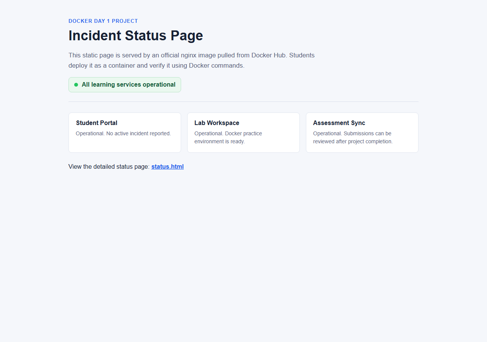
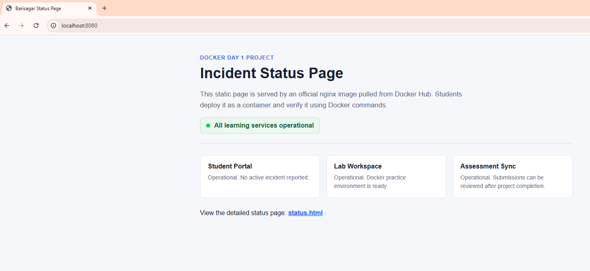

# Day 1 Real-Time Project: Deploy An Incident Status Page With Docker Hub

## Scenario

Your team needs a quick internal status page during a production incident. You do not have time to build a custom image yet. Use the official `nginx` image from Docker Hub and run your static site inside a container.

This project uses only Day 1 concepts:

- Docker installation verification
- Docker Client, Daemon, Host, and Registry flow
- Docker Hub image pull
- Image vs container
- `docker run`, `docker ps`, `docker logs`, `docker stop`, `docker rm`
- Port publishing with `-p`
- Basic cleanup

## Project Goal

Run a ready-made nginx container from Docker Hub and serve the files in `site/` on port `8080`.

Final URL:

```text
http://localhost:8080
```

For EC2:

```text
http://<EC2_PUBLIC_IP>:8080
```

## Folder Structure

```text
real-time-project/
  README.md
  site/
    index.html
    status.html
```

## Step 1: Verify Docker

```bash
docker --version
docker info
docker run hello-world
```

Expected result:

- Docker version is printed.
- Docker daemon information is shown.
- `hello-world` prints a success message.

## Step 2: Pull The Official Nginx Image

```bash
docker pull nginx:1.25-alpine
```

Verify the image exists locally:

```bash
docker images
```

You should see `nginx` with tag `1.25-alpine`.

## Step 3: Run The Status Page Container

From this project folder, run:

```bash
docker run -d \
  --name day1-status-page \
  -p 8080:80 \
  -v "$(pwd)/site:/usr/share/nginx/html:ro" \
  nginx:1.25-alpine
```

Windows PowerShell:

```powershell
docker run -d `
  --name day1-status-page `
  -p 8080:80 `
  -v "${PWD}\site:/usr/share/nginx/html:ro" `
  nginx:1.25-alpine
```

What this command does:

- `-d`: runs container in background
- `--name day1-status-page`: gives the container a readable name
- `-p 8080:80`: maps host port `8080` to container port `80`
- `-v ...:ro`: mounts local `site/` files into nginx as read-only
- `nginx:1.25-alpine`: uses an official image from Docker Hub

## Step 4: Verify The Container

Check running containers:

```bash
docker ps
```

Check logs:

```bash
docker logs day1-status-page
```

Open in browser:

```text
http://localhost:8080
```

Open the status route:

```text
http://localhost:8080/status.html
```

## Step 5: Inspect The Container

```bash
docker inspect day1-status-page
```

Useful focused checks:

```bash
docker inspect --format='{{.State.Status}}' day1-status-page
docker inspect --format='{{.NetworkSettings.IPAddress}}' day1-status-page
```

Windows PowerShell may require double quotes:

```powershell
docker inspect --format="{{.State.Status}}" day1-status-page
docker inspect --format="{{.NetworkSettings.IPAddress}}" day1-status-page
```

## Step 6: Restart Test

Stop the container:

```bash
docker stop day1-status-page
```

Start the same container again:

```bash
docker start day1-status-page
```

Confirm it is running:

```bash
docker ps
```

This shows the difference between:

- `docker run`: creates a new container
- `docker start`: starts an existing stopped container

## Step 7: Cleanup

```bash
docker stop day1-status-page
docker rm day1-status-page
```

Confirm cleanup:

```bash
docker ps -a
```

## Student Deliverables

Submit screenshots or terminal output for:

1. `docker --version`
2. `docker run hello-world`
3. `docker images` showing `nginx:1.25-alpine`
4. `docker ps` showing `day1-status-page`
5. Browser page at `http://localhost:8080`
6. `docker logs day1-status-page`
7. `docker inspect --format='{{.State.Status}}' day1-status-page`
8. `docker ps -a` after cleanup

## Example Evidence Screenshot

Use this as a reference for what a successful browser screenshot should look like:



Student-run browser evidence:



Terminal evidence showing both running containers:


## Assessment Rubric

| Area | Points |
| --- | ---: |
| Docker installed and verified | 15 |
| Pulled official nginx image from Docker Hub | 15 |
| Ran container with correct name and port mapping | 25 |
| Served provided status page successfully | 20 |
| Used logs, ps, and inspect for verification | 15 |
| Cleaned up container properly | 10 |

Total: 100 points

## Common Mistakes

- Running the command from the wrong folder, so `site/` is not mounted
- Forgetting `-p 8080:80`
- Using `docker start` before the container has been created
- Trying to remove a running container without stopping it
- Not opening port `8080` in the EC2 security group

## Interview Practice

1. Why did Docker pull the nginx image from Docker Hub?
2. What is the image in this project?
3. What is the container in this project?
4. Why do we use `docker start` after `docker stop`?
5. What does `-p 8080:80` mean?
6. What does the read-only volume mount `:ro` protect?
