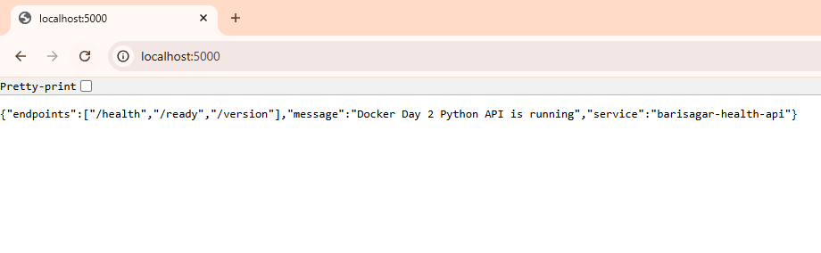
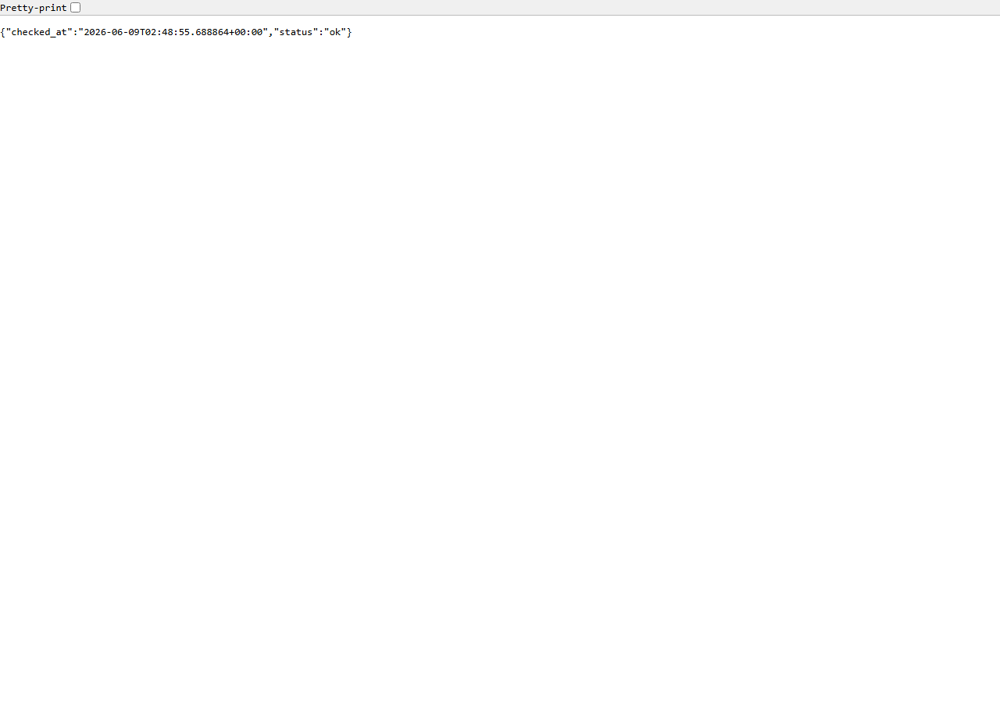
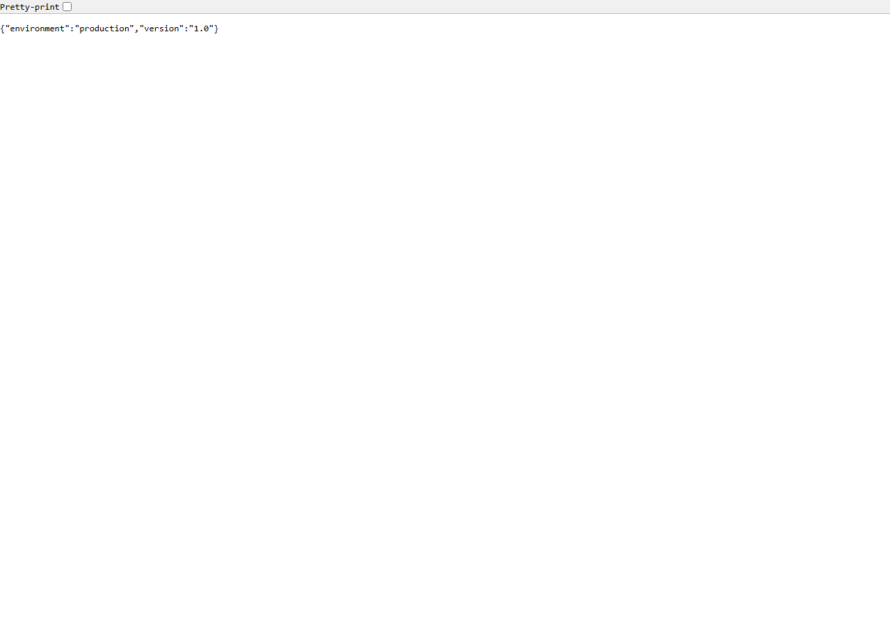
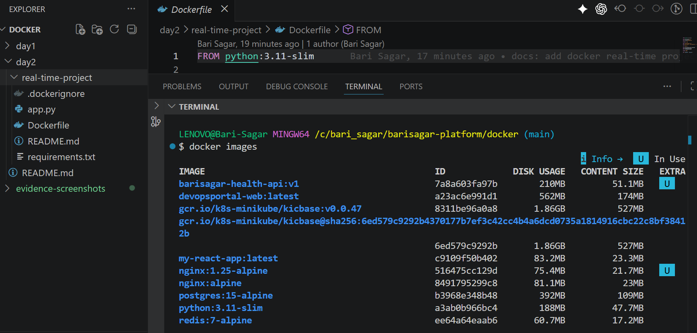
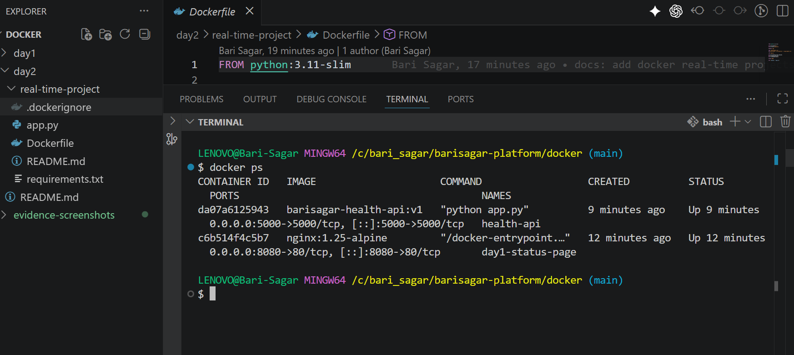

# Day 2 Real-Time Project: Containerize A Python Health API

## Scenario

A small internal API is ready for staging. It works on a developer machine, but the team needs it packaged as a Docker image so it can run consistently on any server.

Your job is to write and run a production-minded Dockerfile for the Python API.

This project uses Day 2 concepts:

- `Dockerfile`
- `FROM`
- `ARG`
- `WORKDIR`
- `COPY`
- `RUN`
- `EXPOSE`
- `CMD`
- `.dockerignore`
- `docker build`
- `docker run`
- `docker logs`
- `docker exec`
- `docker inspect`
- `docker stop`
- `docker rm`

## Project Goal

Build a Docker image for a Python Flask API and run it on port `5000`.

Final URL:

```text
http://localhost:5000
```

Health endpoint:

```text
http://localhost:5000/health
```

## Folder Structure

```text
real-time-project/
  README.md
  Dockerfile
  .dockerignore
  app.py
  requirements.txt
```

## Application Endpoints

| Endpoint | Purpose |
| --- | --- |
| `/` | Basic application response |
| `/health` | Health check endpoint |
| `/version` | Shows app version and environment |
| `/ready` | Readiness-style response |

## Step 1: Review The App

Open `app.py`.

The app listens on:

```text
0.0.0.0:5000
```

This is important because containers must listen on `0.0.0.0`, not only `localhost`.

## Step 2: Review The Dockerfile

The Dockerfile:

- Starts from `python:3.11-slim`
- Uses build-time variables with `ARG`
- Sets `/app` as the working directory
- Copies `requirements.txt` first for layer caching
- Installs Python dependencies
- Copies the application code
- Documents port `5000`
- Starts the API with `CMD`

## Step 3: Build The Image

From this folder:

```bash
docker build -t barisagar-health-api:v1 .
```

Build with custom version:

```bash
docker build \
  --build-arg APP_VERSION=2.0 \
  --build-arg APP_ENV=staging \
  -t barisagar-health-api:v2 .
```

Windows PowerShell:

```powershell
docker build `
  --build-arg APP_VERSION=2.0 `
  --build-arg APP_ENV=staging `
  -t barisagar-health-api:v2 .
```

Verify:

```bash
docker images
```

## Step 4: Run The Container

```bash
docker run -d \
  --name health-api \
  -p 5000:5000 \
  barisagar-health-api:v1
```

Windows PowerShell:

```powershell
docker run -d `
  --name health-api `
  -p 5000:5000 `
  barisagar-health-api:v1
```

Verify:

```bash
docker ps
```

Open:

```text
http://localhost:5000
http://localhost:5000/health
http://localhost:5000/version
http://localhost:5000/ready
```

## Step 5: Use Container Debug Commands

View logs:

```bash
docker logs health-api
docker logs -f health-api
```

Run a command inside the container:

```bash
docker exec health-api ls -la /app
```

Open a shell:

```bash
docker exec -it health-api sh
```

Inspect the container:

```bash
docker inspect health-api
```

Get status:

```bash
docker inspect --format='{{.State.Status}}' health-api
```

Windows PowerShell:

```powershell
docker inspect --format="{{.State.Status}}" health-api
```

Check processes:

```bash
docker top health-api
```

Check resource usage:

```bash
docker stats health-api
```

Press `Ctrl+C` to exit stats.

## Step 6: Practice Lifecycle Commands

Gracefully stop:

```bash
docker stop health-api
```

Start again:

```bash
docker start health-api
```

Pause:

```bash
docker pause health-api
docker ps
```

Unpause:

```bash
docker unpause health-api
```

Restart:

```bash
docker restart health-api
```

Cleanup:

```bash
docker stop health-api
docker rm health-api
```

Remove image:

```bash
docker rmi barisagar-health-api:v1
```

## Step 7: Student Challenge

Modify the project to add one new endpoint:

```text
/owner
```

Expected response:

```json
{
  "owner": "Your Name",
  "project": "Docker Day 2 Health API"
}
```

Then rebuild and rerun:

```bash
docker build -t barisagar-health-api:v3 .
docker run -d -p 5000:5000 --name health-api barisagar-health-api:v3
```

## Student Deliverables

Submit screenshots or terminal output for:

1. `docker build -t barisagar-health-api:v1 .`
2. `docker images`
3. `docker ps`
4. Browser or curl output for `/health`
5. Browser or curl output for `/version`
6. `docker logs health-api`
7. `docker exec health-api ls -la /app`
8. `docker inspect --format='{{.State.Status}}' health-api`
9. Cleanup commands
10. Optional challenge endpoint `/owner`

## Example Evidence Screenshots

Use these as references for what successful browser/API screenshots should look like.

API home endpoint from the student run:



Health endpoint:



Version endpoint:



Terminal evidence showing the built image:



Terminal evidence showing running containers:



## Assessment Rubric

| Area | Points |
| --- | ---: |
| Dockerfile uses correct base image and working directory | 15 |
| Dependency caching pattern is correct | 15 |
| App files are copied and dependencies installed | 20 |
| Container runs and serves API on port 5000 | 20 |
| Logs, exec, inspect, top, and lifecycle commands are practiced | 20 |
| Cleanup completed properly | 10 |

Total: 100 points

## Common Mistakes

- Forgetting `-p 5000:5000`
- App listening on `127.0.0.1` instead of `0.0.0.0`
- Copying all files before installing dependencies, which reduces cache efficiency
- Forgetting `.dockerignore`
- Using `ARG` for secrets
- Trying to remove an image while a container still uses it

## Interview Practice

1. Why do we copy `requirements.txt` before the rest of the code?
2. Why should Flask listen on `0.0.0.0` inside a container?
3. What is the difference between `RUN` and `CMD` in this Dockerfile?
4. What does `EXPOSE 5000` do?
5. What does `.dockerignore` protect?
6. Why should `ARG` not be used for passwords?
7. What is the safest way to stop this container?
