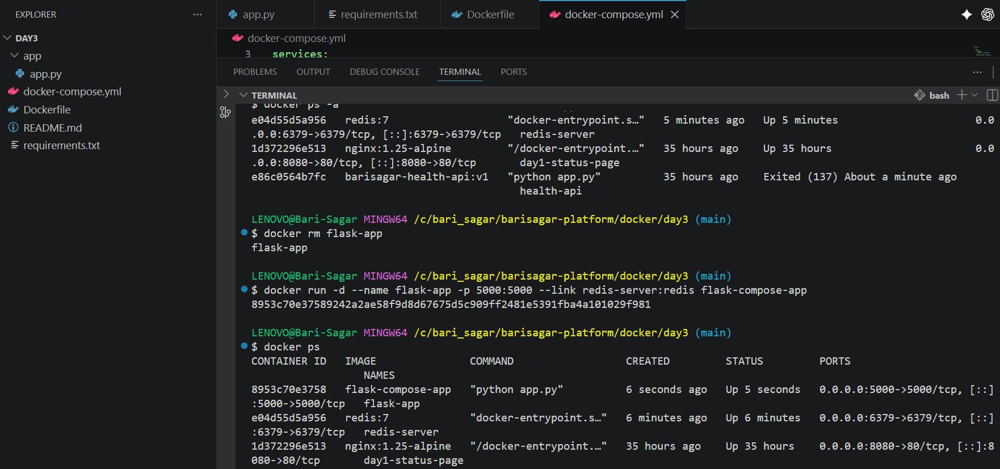
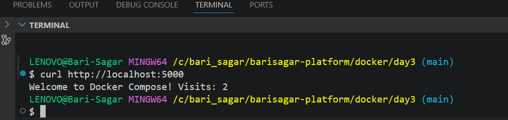
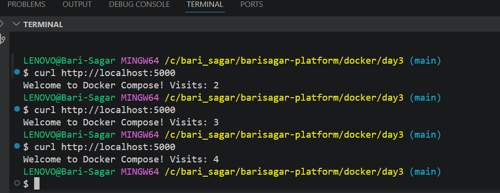

# Docker Day 3 - Multi-Stage Builds and Docker Compose

## Overview

In Day 3, we learned two important Docker concepts used in real-world DevOps projects:

* Multi-Stage Docker Builds
* Docker Compose

Multi-stage builds help us create smaller, more secure, and production-ready Docker images by separating the build stage from the runtime stage.

Docker Compose helps us run multiple containers together using a single YAML configuration file. Instead of running multiple `docker run` commands manually, Docker Compose allows us to define and manage an entire application stack.

In this hands-on project, we built a Flask application that communicates with a Redis database container. Every request to the application increments a counter stored in Redis, demonstrating container-to-container communication and data persistence.

---

# Project Architecture

```text
+------------------------+
|      Flask App         |
|      Port 5000         |
+-----------+------------+
            |
            |
            |
            V
+------------------------+
|       Redis Server     |
|       Port 6379        |
+------------------------+
```

The Flask application connects to Redis and stores the number of visits. Every time a user accesses the application, Redis increments the counter and returns the updated value.

---

# Folder Structure

```text
day3/
│
├── app/
│   └── app.py
│
├── Dockerfile
├── docker-compose.yml
├── requirements.txt
└── README.md
```

---

# What is a Multi-Stage Build?

A Multi-Stage Build is a Docker feature that allows multiple `FROM` instructions within a single Dockerfile.

Each `FROM` instruction starts a new build stage.

The first stage is usually used to:

* Install dependencies
* Compile source code
* Run tests

The second stage is used only for:

* Runtime dependencies
* Application files
* Production execution

This helps create smaller Docker images by excluding unnecessary build tools and temporary files from the final image.

---

# Why Multi-Stage Builds?

Without Multi-Stage Builds:

* Large image sizes
* Build tools included in production
* Slower deployments
* Larger attack surface
* Increased storage usage

With Multi-Stage Builds:

* Smaller images
* Faster deployments
* Improved security
* Cleaner production containers
* Better CI/CD performance

---

# Multi-Stage Dockerfile

## Stage 1 - Builder

The builder stage installs all required Python packages.

```dockerfile
FROM python:3.11 AS builder

WORKDIR /app

COPY requirements.txt .

RUN pip install --user -r requirements.txt
```

---

## Stage 2 - Runtime

The runtime stage copies only the required dependencies from the builder stage.

```dockerfile
FROM python:3.11-slim

WORKDIR /app

COPY --from=builder /root/.local /root/.local

COPY app/ .

ENV PATH=/root/.local/bin:$PATH

EXPOSE 5000

CMD ["python", "app.py"]
```

---

# Understanding COPY --from

The following command copies files from the builder stage into the runtime stage.

```dockerfile
COPY --from=builder /root/.local /root/.local
```

This allows us to reuse installed dependencies without reinstalling them in the final image.

---

# Flask Application

The Flask application connects to Redis and stores a visitor counter.

```python
from flask import Flask
import redis

app = Flask(__name__)

redis_client = redis.Redis(
    host='redis',
    port=6379,
    decode_responses=True
)

@app.route("/")
def home():

    count = redis_client.incr("visits")

    return f"Welcome to Docker Compose! Visits: {count}"

if __name__ == "__main__":
    app.run(host="0.0.0.0", port=5000)
```

---

# What is Docker Compose?

Docker Compose is a tool used to define and manage multi-container applications.

Instead of manually running multiple containers, Docker Compose allows us to define everything in a single YAML file.

Example:

```yaml
services:
  app:
  redis:
```

One command starts the entire application stack.

---

# Docker Compose Configuration

```yaml
version: "3.8"

services:

  app:
    build:
      context: .
      dockerfile: Dockerfile

    container_name: flask-app

    ports:
      - "5000:5000"

    depends_on:
      - redis

  redis:
    image: redis:7

    container_name: redis-server

    ports:
      - "6379:6379"

    volumes:
      - redis-data:/data

volumes:
  redis-data:
```

---

# Understanding Docker Compose Components

## Services

Services define the containers that make up the application.

```yaml
services:
```

---

## Build

Builds a Docker image from the Dockerfile.

```yaml
build:
```

---

## Image

Uses an existing Docker image.

```yaml
image: redis:7
```

---

## Ports

Maps container ports to host ports.

```yaml
ports:
  - "5000:5000"
```

Format:

```text
HOST_PORT:CONTAINER_PORT
```

---

## Volumes

Volumes provide persistent storage.

```yaml
volumes:
  - redis-data:/data
```

Redis data remains available even if the container restarts.

---

## depends_on

Specifies service dependencies.

```yaml
depends_on:
  - redis
```

The Redis container starts before the Flask application.

---

# Container Communication

Docker automatically creates a network.

Containers communicate using service names.

Flask connects to Redis using:

```python
host="redis"
```

Docker automatically resolves:

```text
redis
```

to the Redis container IP address.

No manual IP configuration is required.

---

# Build Docker Image

```bash
docker build -t flask-compose-app .
```

---

# Run Redis Container

```bash
docker run -d \
--name redis-server \
-p 6379:6379 \
redis:7
```

---

# Run Flask Container

```bash
docker run -d \
--name flask-app \
-p 5000:5000 \
--link redis-server:redis \
flask-compose-app
```

---

# Verify Running Containers

```bash
docker ps
```

Expected output:

```text
redis-server
flask-app
```

---

# Test Application

```bash
curl http://localhost:5000
```

Output:

```text
Welcome to Docker Compose! Visits: 1
```

Subsequent requests:

```text
Welcome to Docker Compose! Visits: 2
Welcome to Docker Compose! Visits: 3
Welcome to Docker Compose! Visits: 4
```

---

# Evidence

## Container Verification

The Flask application container and Redis container were successfully started.



This confirms:

* Flask container is running
* Redis container is running
* Port mappings are successful
* Container networking is functional

---

## First Application Request

The application was accessed through localhost.

Command:

```bash
curl http://localhost:5000
```

Output:

```text
Welcome to Docker Compose! Visits: 2
```

Evidence:



This confirms:

* Flask application is accessible
* Redis connection is working
* Request counter is being stored successfully

---

## Redis Counter Verification

Multiple requests were sent to the application.

Output:

```text
Visits: 2
Visits: 3
Visits: 4
```

Evidence:



This confirms:

* Data is stored in Redis
* Redis persistence is working
* Flask and Redis communication is successful

---

# Real-World Use Cases

Docker Compose is commonly used for:

* Web Application + Database
* API + Redis Cache
* Frontend + Backend + Database
* Local Development Environments
* CI/CD Testing Environments
* Microservices Development

Example:

```text
React
  |
  V
NodeJS API
  |
  V
PostgreSQL
```

All containers can be managed using a single Docker Compose file.

---

# Interview Questions

## What is a Multi-Stage Build?

A Multi-Stage Build uses multiple FROM instructions within a single Dockerfile to separate build dependencies from runtime dependencies, resulting in smaller and more secure Docker images.

---

## What are the advantages of Multi-Stage Builds?

* Reduced image size
* Improved security
* Faster deployments
* Smaller attack surface
* Cleaner production images

---

## What is Docker Compose?

Docker Compose is a tool used to define and run multi-container Docker applications using a single YAML configuration file.

---

## How do containers communicate in Docker Compose?

Containers communicate using service names as hostnames through Docker's built-in networking and DNS service discovery.

---

## What is the purpose of depends_on?

The depends_on directive ensures that dependent services start before the current service.

---

## What is the purpose of Volumes?

Volumes provide persistent storage for containers and preserve data even when containers restart.

---

## What is the difference between build and image?

build:
Builds an image from a Dockerfile.

image:
Uses an existing image from Docker Hub or a local repository.

---

# Learning Outcomes

By completing Day 3, we learned:

* Multi-Stage Docker Builds
* Builder and Runtime Stages
* COPY --from
* Docker Compose
* Multi-container Applications
* Service Discovery
* Container Networking
* Volumes
* Data Persistence
* Flask and Redis Integration
* Real-world DevOps Architecture

These concepts are widely used in production-grade containerized applications and form the foundation for Kubernetes and Microservices deployments.
